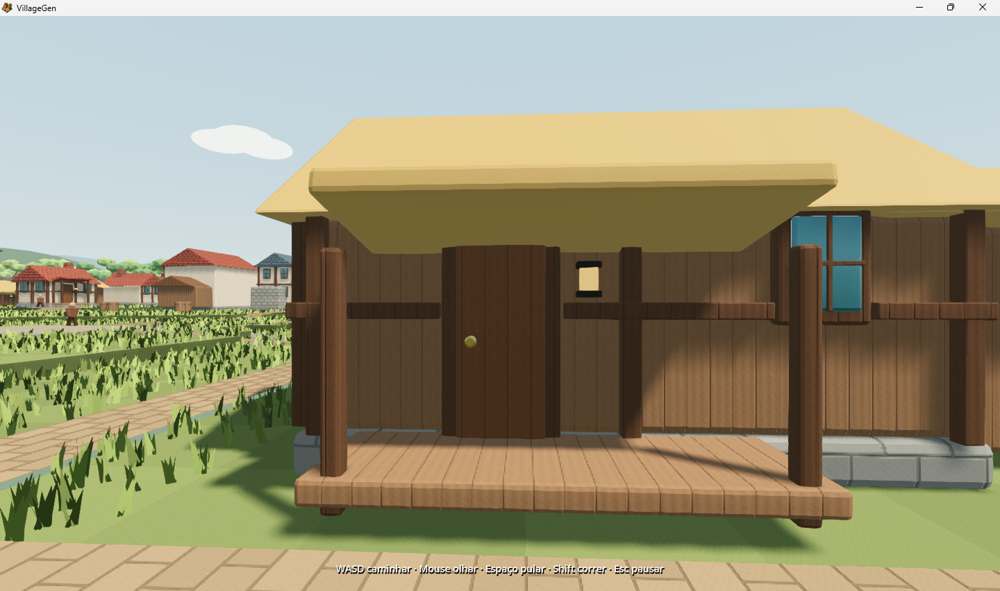
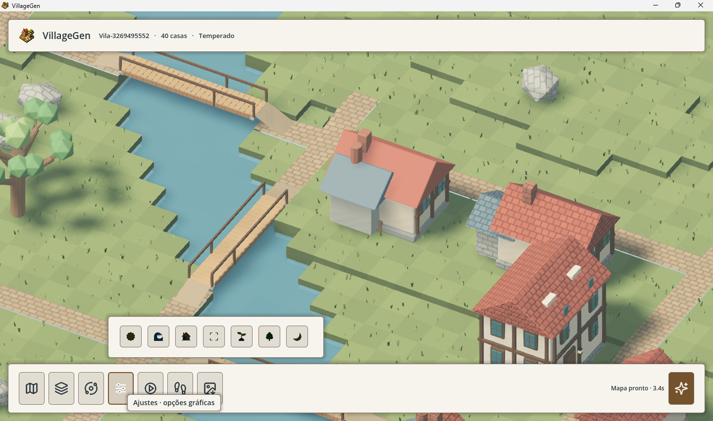

# Claude — corrigir inconsistências visuais do VillageGen

## Pedido atual e limites

O usuário devolveu a versão publicada com dois defeitos: estruturas de madeira aparentemente suspensas nas casas e ícones coloridos escurecidos no tema claro/Sistema. Claude deve reproduzir, determinar as causas, corrigir e procurar inconsistências relacionadas. Este repasse autoriza trabalhar tanto no HUD quanto nos modelos/apoio das construções, superando a antiga divisão de responsabilidade dos documentos `CLAUDE-UI.md` e `CLAUDE-GRAFICOS.md` para este escopo. Não há trabalho Codex concorrente nesses arquivos nesta entrega.

Prioridade: corrigir defeitos, não redesenhar o produto. Preservar Godot C#, execução nativa offline, nome VillageGen, ícone do aplicativo, atalhos, seeds, preferências, salvamento e crescimento. NÃO voltar a WinForms, menu lateral, painéis cheios de texto ou diálogos modais. Ajustes deve continuar sendo uma faixa inferior de sete ícones: clique abre somente a opção correspondente em popup não modal; hover explica. Não reconstruir todo o catálogo nem adicionar dependências antes de comprovar necessidade. Faça escolhas rotineiras e corrija o que estiver neste escopo; peça orientação para mudanças estruturais adicionais.

## Evidências permanentes

As três capturas originais foram copiadas do Temp, sem edição, para:

- `docs/evidencias/revisao-visual-20260907/casa-lateral.png`
- `docs/evidencias/revisao-visual-20260907/casa-frente.png`
- `docs/evidencias/revisao-visual-20260907/icones-tema-claro.png`





Observado nas casas: varanda/piso elevado com vão sob a madeira e apoios que parecem terminar antes do terreno; conferir também encontros entre postes, cobertura, vigas, paredes e fundação. As fotos não identificam `assetId`, variante nem coordenadas; não atribuir a uma família por palpite. Piso elevado não é automaticamente defeito: o que precisa ser coerente é o apoio estrutural e o acesso, inclusive nas palafitas do bioma pantanoso.

A captura da UI mostra seed `Vila-3269495552`, bioma Temperado e 40 casas. Não temos a configuração completa, câmera, seleção do edifício nem estado da simulação; seed sozinha não reproduz necessariamente o caso. Tentar obter o mapa/estado em uso sem sobrescrever seu save ou preferências. Se não estiver disponível, reproduzir a família em cena controlada e registrar a limitação.

## 1. Ícones escurecidos — investigar primeiro

Arquivos centrais: `native/NativeGraphicPopup.cs`, `native/NativeHud.cs`, `native/NativeMenus.cs`; iconsets em `native/assets/ui/` e `native/assets/ui/color/`.

Hipótese forte, ainda não confirmada por experimento: `CompactGraphicSettings()` cria `Button` com textura colorida, mas sem neutralizar a tintura herdada do tema. `ApplyHudTheme()` define `icon_normal_color`, `icon_hover_color`, `icon_pressed_color` e `icon_focus_color` com a cor de texto para Button/OptionButton/LineEdit/CheckButton. Já `ColorOptions()` e os CheckButtons têm overrides brancos em vários estados. A multiplicação da textura colorida pela tinta escura explicaria o screenshot claro. Confirmar antes de corrigir.

Distinguir ícones multicoloridos dos monocromáticos: os primeiros devem preservar RGB; os segundos devem acompanhar contraste do tema. Centralizar a regra para não corrigir apenas os sete botões e deixar outros menus quebrados. Conferir normal, hover, pressionado, hover pressionado, foco e desabilitado; estado desabilitado precisa continuar distinguível. Revisar também a tintura do ícone Ajustes na barra principal mostrada na captura. Não aplicar branco indiscriminadamente a todos os SVGs.

Testar Claro, Escuro e Sistema realmente resolvido nos dois modos do Windows, incluindo troca de tema durante uso. Não alterar o tema global do Windows sem consentimento; usar a camada de resolução do app para testes controlados e explicitar o que foi manual/real. O teste atual que verifica apenas `Icon != null` não detecta textura escurecida: incluir inspeção de pixels/cores ou asserções específicas de modulação efetiva, além de capturas reais. Abrir todos os popups, selecionar opções, mover sliders, fechar por X/Esc/clique fora, verificar foco, cliques no mapa e persistência.

## 2. Casas — localizar a causa, não esconder com decoração

Investigar `tools/blender/architecture.py`, `tools/blender/export_models.py`, `assets/models/catalog.json` e GLBs, `native/Rendering/VillageScene.cs` e `native/Rendering/VillageDetails.cs`. `PrepareEntrances`, `preparedGround` e `BuildingCollider` estão na renderização; verificar os pontos reais pelo código atual. O material procedural pode exagerar juntas/sombras: separar problema de geometria, shader, transformação e relevo.

Para cada ocorrência, registrar seed/configurações, `assetId`, família/variante/bioma, orientação, posição, baseLevel, altura do solo preparado e alturas inferiores dos apoios. Comparar GLB isolado sobre plano com instância no mapa. Conferir o pipeline Blender → GLB → catálogo → transformação/terreno nativo e a cópia dos assets em `native/assets/models`, evitando diagnosticar um GLB antigo como se fosse a exportação nova.

Corrigir suportes de varandas e pilares para se encontrarem com fundação/solo coerentes; não afundar a casa inteira, reescalar o modelo ou adicionar rampas genéricas às portas. Conferir portas, maçanetas, janelas, recortes de vigas, anexos, telhados, degraus e enfeites nos quatro sentidos. Nenhuma peça deve atravessar vãos por acidente, terminar solta ou invadir rua/acesso. Se um apoio depender do relevo, decidir explicitamente o que pertence ao modelo e o que deve ser ajustado na instância. Preservar entradas navegáveis, colisões e diferenças arquitetônicas dos biomas.

Se geometria mudar, regenerar catálogo a partir da geometria final, inclusive anexos/bounds/entrada, e sincronizar assets nativos. Não editar medidas manualmente para fazer testes passarem. Atenção: o save verifica hash do catálogo; mudança pode tornar saves anteriores incompatíveis. Informar esse impacto, preservar os arquivos existentes e não relaxar a validação silenciosamente.

## 3. Auditoria relacionada, proporcional

Depois dos dois defeitos, procurar problemas similares em famílias/variantes representativas nos quatro biomas e orientações, sobre terreno plano e inclinado. Priorizar varandas, anexos, fundações, postes, portas/janelas, contato com ruas e objetos gerados durante crescimento. Examinar também transições de ponte próximas às casas mostradas, sem substituir a integração viária híbrida por uma rede nova. Separar achados corrigidos de melhorias estéticas opcionais; não transformar esta rodada em redesign geral.

Usar poucas seeds fixas primeiro e ampliar quando encontrar padrão. Capturas isométricas sozinhas não bastam: revisar ao nível dos olhos, frente/lateral/trás, e caminhar até as portas. Um build verde ou smoke anterior não comprova ausência desses defeitos: o usuário os encontrou na versão que já havia passado.

## Execução, testes e publicação

Projeto: `D:\Dev\Village`. Ler o início de `PROJETO.md` para o estado atual; documentos antigos contêm decisões superadas. Preservar cópia dos arquivos afetados antes de editar: grande parte do projeto está sem rastreamento/alterada no Git. Não usar reset/checkout para descartar mudanças. Instalações/downloads adicionais, se indispensáveis, ficam na `workbench` do projeto; não encerrar apps do usuário para testar.

```powershell
. ./tools/native-env.ps1
& "$env:DOTNET_ROOT/dotnet.exe" build native/Village.Native.csproj --no-restore --nologo
# Após alterar os modelos:
pwsh -NoProfile -File tools/blender/export-models.ps1
node tools/sync-native-assets.mjs
& $VillageGodot --headless --path native --editor --import --quit
node --test tests/models.test.mjs
# Smoke gráfico, com pasta exclusiva desta rodada:
$env:VILLAGE_SMOKE_DIR='D:/Dev/Village/.cache/claude-visual-smoke'
& $VillageGodot --path native --resolution 1366x768 -- --smoke
# Opcional: --smoke-river depois de --smoke para cenário com rio.
```

Confirmar o caminho do Blender antes do export: o script atual tem default Blender 4.5 em Program Files e recebe `-Blender`. Consultar `tools/blender/README.md` e os argumentos reais do exportador para exportação dirigida; não inventar flags. Repetir smoke em 800×480 e os testes afetados de modelos/colisão/simulação. Testes existentes úteis: `native/SimulationTests/SimulationTests.csproj`, `native/Simulation/SimulationSmoke.tscn`, `native/Rendering/RoadIntegrationSmoke.tscn`. Rodar somente os relevantes às alterações, ampliando por risco concreto.

No smoke, preferências/saves reais devem ficar intactos. Avisos conhecidos: acesso a logs/certificados pode falhar no sandbox; NU1900 indica consulta NuGet indisponível; havia aviso de sete RIDs de textura ao encerrar. Não classificar outros erros como conhecidos sem investigar. Não apresentar FPS/economia estimados como medidos. Equilibrada atual = FXAA sem MSAA; Alta = MSAA 4× + FXAA; Máxima = supersampling 1,5×; limite de 60 fps mantido. Preservar isso nesta revisão, salvo defeito comprovado.

Executável instalado: `dist/Village/Village.exe`. Atalho VillageGen na Área de Trabalho aponta para ele, com `assets/app-icon/villagegen.ico`. Nesta rodada, preparar fontes/assets e entrega verificadas, SEM substituir automaticamente a instalação nem recriar o atalho. A publicação fica para revisão final do Codex/usuário; não fechar o jogo aberto para liberar arquivos.

## Entrega obrigatória

Atualizar este Markdown com causas comprovadas, arquivos alterados, correções, comandos/resultados reais, pendências e impacto nos saves. Acrescentar links/capturas antes/depois dos mesmos modelos e temas; informar o que foi testado programaticamente e o que foi inspecionado visualmente. Registrar as descobertas adicionais por gravidade e reprodução. Atualizar `PROJETO.md` com o estado relevante, explicitando que ainda não foi publicado. Se faltar identificação exata da casa original, não declarar que a ocorrência original foi reproduzida: demonstrar a correção na família localizada e explicar a cobertura.

---

# Entrega — Claude, 7 de setembro de 2026

Nada foi publicado: `dist/Village/Village.exe` e o atalho continuam intocados, o aplicativo aberto do usuário não foi fechado e as fontes ficam prontas para revisão do Codex.

## Resumo

Os dois defeitos foram reproduzidos, tiveram causa comprovada por medição e estão corrigidos. A auditoria relacionada encontrou um terceiro defeito sistemático, do mesmo tipo, no bioma pantanoso, além de dois achados menores corrigidos e três documentados sem correção.

**Os saves existentes continuam válidos.** `assets/models/catalog.json` ficou byte a byte idêntico ao anterior (`sha256 4066f463…`), então o `catalogHash` do envelope não muda. Isso foi resultado de decisão deliberada, explicada em "Impacto nos saves".

## 1. Ícones escurecidos — causa comprovada

A hipótese do repasse estava certa e foi confirmada por experimento, não por leitura.

`CompactGraphicSettings()` criava sete `Button` comuns e atribuía a textura (`native/NativeGraphicPopup.cs:30-32`) sem neutralizar a tinta do tema. `ApplyHudTheme()` define `icon_normal_color` e estados irmãos como a cor do texto para `Button`; a textura é **multiplicada** por essa cor. No tema claro a tinta é `#26343b`, e seis ícones multicoloridos viravam manchas quase pretas. O sétimo, "Qualidade de imagem", usa o `scan.svg` monocromático e aparecia correto — é exatamente o que se vê na captura original, onde o quarto ícone é o único legível.

Confirmação: com a correção removida, a verificação nova acusa `Icone colorido tingido pelo tema 1: @Button@196 tinta=26343bff (res://assets/ui/color/sun.svg)`.

**Regra centralizada.** Foi criado `KeepIconColors(Control)` em `NativeHud.cs`, usado por `ColorOptions()`, pelos sete botões de Ajustes, por Reflexos/Detalhes, pelo alternador Rio e pelos seletores de Regiões. Cobre `normal`, `hover`, `pressed`, `hover_pressed`, `focus` e `disabled` — o `ColorOptions` anterior cobria só quatro estados. Desabilitado perde alfa (45%), não matiz, para continuar distinguível.

Também foi removida a regra global `theme.SetColor("icon_*_color","CheckButton",Colors.White)`: era por tipo, não por ícone, e teria escurecido ou embranquecido errado qualquer `CheckButton` monocromático futuro. A neutralização passou a ser por controle.

Os monocromáticos de `assets/ui/` continuam recebendo a tinta do tema, que é o que lhes dá contraste — não foi aplicado branco indiscriminadamente.

| Antes | Depois (tema claro) |
|:--|:--|
| `docs/evidencias/revisao-visual-20260907/icones-tema-claro.png` | `docs/evidencias/revisao-visual-20260907/depois/ajustes-claro.png` |

## 2. Madeiras e apoios suspensos — causa comprovada

Medido no GLB, não estimado. Em `assets/models/temperate-farmstead-0.glb` o material "Aged oak" começava em **y = 0,165** e "Dark beams" em **y = 0,110**, enquanto "Foundation stone" começava em 0,000.

A origem está em `tools/blender/architecture.py`, em `build_farmstead`. `box()` posiciona pelo centro:

- `PorchDeck`, altura 0,13 com centro em 0,23 → base em **0,165**, no ar.
- `PorchPost`, altura 1,22 com centro em 0,72 → base em **0,110**, no ar, e topo em 1,33 contra um beiral em ~1,40: **os dois extremos soltos**.

Os dois tocos que aparecem sob o tabuleiro na captura `casa-frente.png` são justamente os 0,055 de pilar que sobravam abaixo do deque.

**Correção.** Plinto de pedra `PorchBase` de 0 a 0,165 sob o tabuleiro, na mesma pedra da fundação e no mesmo padrão que a variante do chalé já usava; pilar de 0,275 (topo do deque) a 1,425, encontrando o beiral. A casa não foi afundada, reescalada, nem ganhou rampa.

Não foi possível identificar a casa exata da captura original: as fotos não trazem `assetId`, variante nem coordenadas, e a seed `Vila-3269495552` sozinha não reproduz câmera nem estado. A família foi localizada pelas características visíveis — telhado de colmo, paredes de tábua com enxaimel, varanda sem base de pedra — que só a família `farmstead` reúne, e a correção está demonstrada nela. **Não afirmo ter reproduzido a ocorrência original**; afirmo ter reproduzido e corrigido o defeito na família que a captura mostra.

A mesma varredura encontrou o mesmo tipo de erro em mais seis lugares, todos corrigidos:

| Objeto | Base antes | Problema | Depois |
|:--|--:|:--|:--|
| `PorchPost` (farmstead) | 0,110 | solto embaixo e sem alcançar o beiral | 0,275 → 1,425 |
| `PorchDeck` (farmstead) | 0,165 | tabuleiro no ar | plinto 0 → 0,165 |
| `SmithyPost` | 0,040 | solto embaixo e 0,125 abaixo da cobertura | 0 → 1,56 |
| `TownhouseGalleryPost` | 0,055 | solto embaixo | 0 → 1,71 |
| `WorkshopVariantPost` | 0,030 | solto embaixo | 0 → 1,55 |
| `ShopVariantPost` | 0,040 | solto embaixo | 0 → 1,78 |
| `CivicVariantColumn` | 0,050 | solto embaixo | 0 → 2,05 |
| `ArtisanBenchLeg` | 0,050 | solto embaixo | 0 → 0,63 |
| `WatchRail` (torre) | 3,80 | corrimão pairando 0,54 acima do piso da galeria | balaústres 3,26 → 3,90 |
| `BenchBack` (`prop:bench`) | 0,56 | encosto 0,05 acima do assento | travessa 0,48 → 0,57 |

## 3. Achado maior: bioma pantanoso erguia tudo e não apoiava nada

`raise_swamp()` em `tools/blender/export_models.py` subia **todos** os objetos 0,7 e acrescentava quatro esteios apenas nos cantos do envelope. Consequência, em todos os 40 modelos do bioma: pilares de galeria, pés de banco e o tabuleiro da varanda ficavam pendurados a 0,7 do chão, e caixotes, barris, bigorna e forja boiavam ao lado da palafita. É o mesmo defeito relatado, em escala maior, e era anterior a esta rodada.

Primeira tentativa minha, por lista de nomes, quebrou props compostos — ergueu os arcos e deixou o barril no chão — e derrubou a altura de `wetland:workshop` em 0,63. Foi substituída.

**Solução adotada:** o critério passou a ser geométrico, não nominal. Peças que se tocam formam um conjunto (união por contato em 3D); o conjunto da casa sobe, e um conjunto solto que já vivia no chão — barril com seus arcos, bigorna com o tampo, banco com os pés — fica onde estava. Apoios verticais do conjunto da casa que tocavam o solo ganham um pilote próprio até o chão; plinto largo vira dois pilotes de madeira em vez de um bloco maciço, para o vão aberto sob a palafita continuar existindo.

Evidência: `docs/evidencias/revisao-visual-20260907/depois/wetland-farmstead-0-rasante.png`.

## 4. Verificação permanente acrescentada

O repasse observou, com razão, que testar `Icon != null` não detecta textura escurecida. Foram acrescentadas três verificações que falham o smoke, não apenas imprimem:

- **`HUD_ICON_TINT_CHECK`** (`NativeHud.cs`): varre todo controle do HUD pelo **caminho da textura**, nos dois temas. Ícone de `ui/color/` com tinta diferente de branco reprova; ícone monocromático com menos de 2,5:1 contra o próprio preenchimento também. A varredura por caminho pega qualquer ícone colorido novo, não apenas os sete conhecidos. Mede 23 coloridos e 25 monocromáticos por tema.
- **`SUSPENSO`** (`tools/blender/export_models.py`): auditoria por objeto, antes da junção por material — depois dela a informação some. Uma peça é suspensa quando sua base está acima de 0,02 e ela **não encosta em nada** em 3D. A primeira versão usava só empilhamento vertical e acusava caixilho de janela preso na parede; foi corrigida.
- **`BUILDING_OVERHANG_CHECK`** (`VillageScene.cs`): conta células sob o *bounds real do modelo* cujo solo preparado não está no `baseLevel` do prédio. Responde se um apoio corrigido no GLB ainda pode aparecer solto na vila.

## 5. Interação com o terreno — medida, não suposta

Eu suspeitei que a varanda avançasse além do footprint declarado e ficasse sobre terreno não nivelado. **Duas hipóteses minhas caíram aqui, e as duas estão registradas porque erraram o alvo:**

1. Uma análise do `heightLevel` cru sugeriu 12 de 32 prédios com desnível adjacente. Errada: lia o relevo bruto, não o solo preparado.
2. A própria premissa do balanço estava errada. O `footprint` do catálogo não é o valor devolvido por `build_farmstead`; é derivado da geometria real no exportador (`math.ceil` sobre o bounds). Para `temperate:farmstead:0` ele é **5×4**, e o modelo mede 4,44 × 3,84 — cabe inteiro. `tests/models.test.mjs` já cobra isso.

A medição correta, dentro do renderizador, dá `BUILDING_OVERHANG_CHECK predios=0 celulas=0 desnivel_max=0,00` no cenário padrão e no cenário com rio. **Não há correção de terreno a fazer, e nunca houve balanço**: o defeito era inteiramente geometria do modelo. A verificação fica como rede de segurança para o caso de alguém desacoplar footprint de bounds.

## Arquivos alterados

| Arquivo | Escopo |
|:--|:--|
| `tools/blender/architecture.py` | 8 apoios que não encostavam no chão; plinto da varanda do farmstead |
| `tools/blender/export_models.py` | `raise_swamp` por agrupamento geométrico; balaústres da torre; auditoria `SUSPENSO` |
| `tools/blender/environment_models.py` | travessa do encosto do banco |
| `native/NativeGraphicPopup.cs` | neutralização da tinta nos seis ícones coloridos |
| `native/NativeHud.cs` | `KeepIconColors`, remoção da regra global de CheckButton, `HUD_ICON_TINT_CHECK`, correção da asserção de antisserrilhado |
| `native/NativeMenus.cs` | Reflexos/Detalhes/seletores de Regiões; captura de Ajustes nos dois temas |
| `native/Rendering/VillageScene.cs` | `BUILDING_OVERHANG_CHECK` |
| `native/Rendering/ModelPreview.cs` + `.tscn` | render controlado de modelo isolado sobre plano |
| `assets/models/*.glb`, `native/assets/models/**` | reexportados |

Cópia do estado anterior em `.cache/before-revisao-visual-20260907/`. Nenhum arquivo foi descartado por `reset`/`checkout`.

## Correção fora do escopo original

`HUD_IMAGE_CHECK` reprovava com "Viewport lost anti-aliasing". A asserção era minha, de rodada anterior, e exigia MSAA especificamente — verdade quando Equilibrada usava MSAA 2×, falso desde que o perfil passou a ser FXAA sem MSAA. Corrigi **a asserção**, não o perfil: agora exige algum antisserrilhado ativo (MSAA, FXAA ou supersampling). Equilibrada = FXAA sem MSAA, Alta = MSAA 4× + FXAA, Máxima = supersampling 1,5× e o limite de 60 fps continuam como estavam.

## Impacto nos saves

**Nenhum.** `assets/models/catalog.json` é byte a byte idêntico ao anterior, e `VillageSaveFile.CatalogHash` é o SHA-256 do arquivo inteiro: um único byte diferente recusaria todos os saves.

Isso exigiu duas decisões:

1. Reescalar um objeto já com transformação aplicada desloca o arredondamento do modelo inteiro. A primeira versão da correção do pântano mudava a altura de `wetland:cottage:2` em 3×10⁻⁸ — nada visualmente, mas o bastante para invalidar todo save gravado. Os apoios passaram a ser prolongados por **peça nova** em vez de reescalar a existente.
2. Pelo mesmo motivo, o vão do encosto do banco foi fechado por uma travessa nova (`BenchBrace`), não redimensionando `BenchBack`.

A validação **não foi relaxada** em nenhum ponto. Os arquivos de save e as preferências do usuário não foram tocados; o smoke não escreve preferências.

## Pendências e achados não corrigidos

Por gravidade, com reprodução (`pwsh -NoProfile -File tools/blender/export-models.ps1`, linhas `SUSPENSO`):

1. **`arid:townhouse:0..3` — `DormerRoof` a 3,55.** No bioma árido `biome_roof` substitui o telhado inclinado por uma laje plana de 0,22 em `eave_z`. As mansardas e seus telhadinhos mantêm coordenadas calculadas para telhado inclinado e ficam pairando acima da laje. Não corrigido: resolver bem significa repensar a cobertura árida (mansarda sobre laje plana não faz sentido arquitetônico), o que é mudança estrutural — peço orientação.
2. **`arid:civic:0..1` — `CivicFinial` a 4,62.** Mesma causa: o coruchéu foi posicionado para o ápice do telhado inclinado da cúpula, que no árido não existe. Fica 0,45 acima da laje.
3. **`bridge:middle` — `ContinuousRail`.** Não é defeito: o corrimão é contínuo entre módulos e os postes vêm dos módulos `post`/`start`/`end` vizinhos. Confirmado na captura original do usuário, onde as duas pontes mostram postes periódicos. Fica registrado para a auditoria não reabrir o caso.

Outras pendências:

4. **Revisão em tela ainda é do usuário/Codex.** Tudo aqui foi verificado por medição e por captura headless. Não abri nem fechei o aplicativo do usuário.
5. **Tema Sistema não foi testado alternando o tema real do Windows.** Testei Claro e Escuro pela camada de resolução do app, nos dois sentidos, e Sistema resolve por `DisplayServer.IsDarkMode()`. Não alterei a configuração do Windows do usuário, como pedido; a cobertura de Sistema é, portanto, indireta.
6. **A cobertura de biomas na auditoria visual foi por amostra dirigida** — temperado e pantanoso ao nível dos olhos, árido e nevado apenas pela auditoria numérica `SUSPENSO`.

## Comandos e resultados reais

```powershell
. ./tools/native-env.ps1
& "$env:DOTNET_ROOT/dotnet.exe" build native/Village.Native.csproj --no-restore --nologo   # 0 erros, 1 aviso (NU1900)
pwsh -NoProfile -File tools/blender/export-models.ps1                                      # 160 buildings, 15 props, 5 bridges
node tools/sync-native-assets.mjs                                                          # 180 sincronizados
& $VillageGodot --headless --path native --editor --import --quit
node --test tests/models.test.mjs                                                          # 2 pass, 0 fail
$env:VILLAGE_SMOKE_DIR='D:/Dev/Village/.cache/claude-visual-smoke-1366x768'
& $VillageGodot --path native --resolution 1366x768 -- --smoke                             # NATIVE_SMOKE_OK
& $VillageGodot --path native --resolution 800x480 -- --smoke                              # NATIVE_SMOKE_OK
& $VillageGodot --path native --resolution 1366x768 -- --smoke --smoke-river               # NATIVE_SMOKE_OK
& "$env:DOTNET_ROOT/dotnet.exe" run --project native/SimulationTests/SimulationTests.csproj # 22 passaram, 0 falharam
& $VillageGodot --headless --path native res://Simulation/SimulationSmoke.tscn              # SIM_SMOKE_OK
& $VillageGodot --headless --path native res://Rendering/RoadIntegrationSmoke.tscn          # ROAD_SMOKE_OK runs=744
$env:VILLAGE_PREVIEW_DIR='D:/Dev/Village/.cache/model-preview-depois'
$env:VILLAGE_PREVIEW_MODELS='temperate-farmstead-0,wetland-farmstead-0'
& $VillageGodot --path native --resolution 1280x720 res://Rendering/ModelPreview.tscn       # MODEL_PREVIEW_OK
```

Medições nas duas resoluções: `HUD_ICON_TINT_CHECK theme=1 coloridos=23 monocromaticos=25` e o mesmo em `theme=2`; `GRAPHIC_POPUP_CHECK icons=7 controls=True nonModal=True qualityProfiles=True`; `BUILDING_OVERHANG_CHECK predios=0 celulas=0 desnivel_max=0,00`.

## O que foi testado por programa e o que foi olhado

**Por medição:** bases e topos de todos os objetos dos 180 GLBs; tinta efetiva de 48 ícones por tema; solo preparado sob o bounds de cada prédio; igualdade byte a byte do catálogo; dentes das duas verificações novas (removida a correção, o smoke reprova apontando o ícone e a textura exatos).

**Por inspeção visual:** faixa de Ajustes nos dois temas; farmstead temperado de frente, de lado e rasante; ferraria temperada; farmstead e loja do pântano rasantes; passeio ao nível dos olhos; porta sul em jogo. O HUD inferior continua só por ícones com dica, e os popups de Ajustes continuam não modais, abrindo um controle por clique e fechando por X, Esc, clique fora, troca de página ou redimensionamento — verificado por `GRAPHIC_POPUP_CHECK` e pelas capturas.

**Não verificado:** aparência em hardware/monitor do usuário, tema Sistema alternado no Windows real, e as demais famílias dos biomas árido e nevado ao nível dos olhos.

---

# Handoff ao Codex — inclusive para mudar a arquitetura

O usuário pediu explicitamente que o Codex possa **repensar a arquitetura das construções**, trocando o que for necessário. Esta seção existe para isso: o que descobri, o que é contrato de verdade, o que quebra se for mexido, e o que das minhas correções é estrutural e o que é remendo descartável.

## Correção de um erro meu nesta entrega

Na seção 5 eu escrevi que "a varanda do `farmstead` avança ~0,71 além do footprint declarado". **Está errado, e a explicação que dei para o resultado zerado também.**

O `footprint` do catálogo não vem do valor devolvido por `build_farmstead`; é derivado da geometria real no exportador (`export_models.py`, `footprint=dict(width=math.ceil(width - 1e-6), ...)`). Para `temperate:farmstead:0` o footprint é **5×4**, não 4×3, e o modelo mede 4,44 × 3,84 — cabe inteiro. `tests/models.test.mjs` já cobra isso (`max-min <= footprint + 0.001`).

Ou seja: `BUILDING_OVERHANG_CHECK predios=0` está correto, mas não porque o corredor de acesso salvou um balanço — **não havia balanço nenhum**. O defeito era 100% geometria do modelo. A verificação continua útil como rede de segurança se alguém desacoplar footprint de bounds.

## O que é contrato real hoje

Quem consumir ou mudar o catálogo precisa saber quem depende de cada campo. Levantado por leitura do código, não de memória:

| Campo | Consumidores | Consequência de mudar |
|:--|:--|:--|
| `bounds` | `VillageScene.AssetBounds` → `BuildingCollider` e `VillageBounds`; `GrowthPlanner.cs:94` para bloquear props | Colisão da casa e área bloqueada no crescimento |
| `footprint` | `GrowthPlanner.cs:204` ordena candidatos por área; parcelamento do gerador | Que modelo cabe em que lote |
| `entrance` | `GrowthPlanner.cs:245`, `Ecology.cs:71`, lanternas em `VillageScene` | Acesso navegável, reserva de corredor, decoração da porta |
| `height` | colisor cilíndrico de props | Colisão de árvores |
| arquivo inteiro | `VillageSaveFile.CatalogHash` (SHA-256) | **Todo save gravado** |

`tests/models.test.mjs` impõe, e vale manter ou substituir conscientemente: bounds do catálogo iguais à geometria real com tolerância 0,001; modelo dentro do footprint; entrada na fachada +Z; entrada dentro do bounds em X; e altura da entrada igual ao piso real da porta.

## O ponto que motiva a mudança arquitetural

O achado que não corrigi é o que melhor justifica repensar o desenho, e não é um bug isolado:

**`biome_roof()` substitui o telhado, mas os ornamentos não sabem disso.** No bioma árido o telhado inclinado vira uma laje plana de 0,22 em `eave_z`. Tudo que foi posicionado assumindo um telhado inclinado — mansardas de `build_townhouse`, coruchéu de `build_civic` — continua nas coordenadas antigas e fica pairando. Nevado e pantanoso só multiplicam a altura (1,38 e 1,15), então escapam por sorte, não por desenho.

A raiz é que **a família e o bioma não se conhecem**. `build_*` desenha uma casa europeia de telhado inclinado; `biome_roof` troca a cobertura por baixo dos panos; `raise_swamp` ergue tudo depois. São três camadas que se sobrepõem sem contrato entre si. Enquanto for assim, cada bioma novo vai reabrir a mesma classe de defeito.

Se o Codex for redesenhar, sugiro que o contrato explícito seja: **a família publica pontos de ancoragem** (topo de parede, linha de beiral, ápice, piso elevado, linha do solo) e o bioma implementa a cobertura respeitando esses pontos, em vez de trocar uma função global. Isso resolve mansarda, coruchéu e palafita pela mesma via. É sugestão, não decisão — a decisão é do Codex e do usuário.

## O que das minhas correções é estrutural e o que é remendo

Para o Codex não preservar o que não vale a pena:

**Vale manter (ou substituir por algo melhor, mas não simplesmente apagar):**
- `audit_supports()` / linhas `SUSPENSO` em `export_models.py`. É o único lugar onde dá para ver peça por peça: depois da junção por material a informação some. Hoje **só imprime**; virar `raise` é uma linha, e num redesenho vale a pena que seja bloqueante.
- `raise_swamp()` por agrupamento geométrico. Não é remendo: substitui lista de nomes por um critério que continua valendo quando modelos novos aparecerem.
- `HUD_ICON_TINT_CHECK` e `KeepIconColors`. A regra "multicolorido preserva RGB, monocromático segue o tema" é independente de arquitetura de modelos.
- `native/Rendering/ModelPreview.cs` + `.tscn`. Harness de render isolado sobre plano em y=0, com três câmeras (frente, lateral, rasante) e relato de `min.Y`. Serve para qualquer redesenho:
  ```powershell
  $env:VILLAGE_PREVIEW_DIR='D:/Dev/Village/.cache/preview'
  $env:VILLAGE_PREVIEW_MODELS='temperate-farmstead-0,wetland-shop-1'
  & $VillageGodot --path native --resolution 1280x720 res://Rendering/ModelPreview.tscn
  ```

**Remendo consciente, descartável num redesenho:**
- O plinto `PorchBase` do farmstead. Resolve o sintoma copiando o padrão que a variante do chalé já usava. Se a varanda for repensada, jogue fora.
- Os ajustes numéricos de altura dos oito apoios. São correções pontuais de coordenada, não desenho.
- A travessa `BenchBrace`. Existe só para fechar o vão **sem reescalar** o encosto e assim não mudar o hash. Num redesenho, corrija o encosto direto.

**Restrição que eu me impus e o Codex não precisa herdar:** mantive o catálogo byte a byte idêntico para não recusar saves. Isso me obrigou a prolongar apoios por peça nova em vez de reescalar a existente, porque reescalar um objeto já transformado desloca o arredondamento do modelo inteiro — 3×10⁻⁸ bastava para invalidar tudo.

**Num redesenho arquitetural isso não se sustenta.** Qualquer mudança real de geometria muda `bounds`/`height`, muda o catálogo e **recusa todos os saves existentes**. As opções, para decisão do usuário:

1. Aceitar a quebra e avisar (`VillageSaveFile.Read` já lança "Salvamento incompatível com esta versão ou catálogo").
2. Migrar: subir `saveVersion`, guardar o catálogo antigo e aceitar saves com o hash anterior, remapeando `assetId` quando o modelo mudar de forma.
3. Tirar o hash do catálogo do envelope e validar só o que o save realmente depende (ids existentes, footprints compatíveis).

Não decidi por nenhuma: a opção 1 é a atual, e as outras duas mexem no contrato de persistência, que é mudança estrutural.

## Achados abertos, com reprodução

`pwsh -NoProfile -File tools/blender/export-models.ps1` e leia as linhas `SUSPENSO`. Estado atual, depois das minhas correções:

| Achado | Modelos | Causa | Situação |
|:--|:--|:--|:--|
| `DormerRoof@3.55` | `arid:townhouse:0..3` | laje plana árida vs mansarda de telhado inclinado | aberto, aguarda decisão arquitetural |
| `CivicFinial@4.62` | `arid:civic:0..1` | coruchéu posicionado para o ápice da cúpula inclinada | aberto, mesma causa |
| `ContinuousRail@0.62` | `bridge:middle` | por desenho: postes vêm dos módulos vizinhos | não é defeito, registrado para não reabrir |

Nada mais aparece na varredura dos 180 modelos.

## Cobertura que ficou faltando

Para o Codex saber onde ainda não se olhou, e não confundir "não apareceu" com "não existe":

- Ao nível dos olhos, olhei **temperado e pantanoso**. Árido e nevado passaram só pela auditoria numérica.
- Tema **Sistema** não foi testado alternando o Windows real, por não alterar a configuração do usuário sem consentimento.
- Não testei as quatro orientações de cada família em terreno inclinado; `BUILDING_OVERHANG_CHECK` cobre isso por medição, mas em duas seeds só.
- Não abri o aplicativo do usuário nem publiquei. `dist/Village/Village.exe` e o atalho estão como estavam.

## Estado para continuar

Fontes compilam (0 erros), todos os testes citados passam, os assets estão exportados e sincronizados em `native/assets/models/`, e o catálogo está idêntico ao de antes desta rodada. Backup em `.cache/before-revisao-visual-20260907/`. O Codex pode continuar de onde está, ou reescrever a camada de modelos inteira — nenhuma das minhas mudanças cria dependência nova entre módulos.

---

## Decisão e implementação Codex — 7 de setembro de 2026

Esta seção supera o estado do handoff acima. Adotada a proposta de âncoras, com um perfil imutável resolvido antes da construção: `tools/blender/building_contract.py` define `BuildingProfile` e `RoofPlan`; `architecture.BuildingContext` combina esse perfil com paleta e coberturas nomeadas. Famílias pedem `mats.roof(...)` e consultam a superfície real, o topo da parede/beiral e o ápice. O exportador não substitui mais uma função global para trocar silenciosamente o desenho do telhado. Toldos leves continuam componentes explícitos das famílias, não coberturas substituídas pelo bioma.

Mansardas do sobrado agora derivam apoio da superfície real e recebem também o deslocamento Y que faltava à cobertura. No árido são volumes com tampa plana apoiados na laje. Cúpula e coruchéu cívicos derivam da cobertura efetiva, em vez de alturas presumidas do telhado inclinado. A elevação do pântano vem de `profile.floor_lift` e mantém a separação geométrica entre conjuntos da casa e objetos originalmente no chão. As âncoras são transformadas até as coordenadas finais GLB e publicadas no catálogo em `anchors`; `construction` registra versão do contrato, estilo de cobertura e elevação.

Preservados os apoios corrigidos pelo Claude, `KeepIconColors`, o agrupamento de `raise_swamp`, o HUD e os perfis gráficos. Plinto, travessa do banco e apoios locais não foram descartados: continuam úteis e não precisam ser reescritos para corrigir o contrato de cobertura. `environment_models.py` não precisou mudar. Bounds, entradas e footprints continuam medidos da geometria, sem encolher modelos no renderer. IDs permanecem estáveis e o mapa continua schema 4. Dos 160 edifícios reexportados, 24 tiveram alteração em bounds/altura/entrada; nenhum footprint mudou. Catálogo não é mais byte a byte idêntico, também por conter as novas âncoras.

### Persistência: decisão explícita do usuário

O usuário dispensou savegame até a fase final do produto. Portanto não foi escolhida uma migração nem removida a validação de hash do envelope: **retirado o save/load funcional do aplicativo**. Removidos os dois botões da Simulação, o controlador `NativePersistence.cs` e seu UID; o smoke da aplicação agora exige o marcador `SAVEGAME_DISABLED`. Preferências e seed de configuração permanecem, arquivos de saves existentes não foram apagados, lidos ou migrados nesta rodada. Tipos de serialização e testes isolados do núcleo permanecem para eventual uso futuro, mas não há caminho ativo de salvar/carregar no aplicativo. Essa escolha evita condicionar a correção da geometria à identidade binária do catálogo. Retomar savegame exigirá uma decisão nova de contrato e compatibilidade.

### Verificações e evidências desta rodada

Backup das fontes afetadas e dos modelos anteriores em `.cache/before-building-contract/`. Exportação completa primeiro em `.cache/building-contract-export/`, depois sincronizada para assets do projeto e nativos. Foram exportados 180 modelos: 160 edifícios, 15 objetos e cinco peças de ponte. `audit_supports` agora interrompe a exportação diante de peça isolada; só admite `ContinuousRail` no módulo `bridge:middle`. Um teste injeta peça suspensa e comprova a recusa. Importante: contato de AABBs não garante contato entre triângulos, apoio estrutural ou conexão de todo conjunto ao solo; a auditoria não substitui inspeção visual.

Passaram quatro testes Blender (`building-contract-tests.log`), três testes de catálogo e geometria real GLB (`building-contract-models.log`), 12 seeds da regressão nativa (`building-contract-core.log`), `SIM_SMOKE_OK` (`building-contract-simulation.log`) e compilação sem erros (`building-contract-build.log`), todos em `.cache/`. O build registra NU1900 por consulta de auditoria NuGet indisponível, não uma auditoria de dependências aprovada.

Smoke nativo 1366×768 com rio aprovado em `.cache/building-contract-smoke.log`: `NATIVE_SMOKE_OK`, `BUILDING_OVERHANG_CHECK predios=0 celulas=0`, passeio e escadas, `SAVEGAME_DISABLED` e `HUD_ICON_TINT_CHECK` para Claro/Escuro (23 coloridos e 23 monocromáticos após retirar salvar/carregar). Não foi repetida a matriz de 300 seeds, nem medido novo desempenho. Continua o aviso conhecido de sete RIDs de textura ao encerrar.

O preview ganhou uma quarta câmera, `cobertura`, pois a vista ao nível dos olhos não enquadra adornos altos. Geradas 40 imagens de dez modelos em `.cache/building-contract-preview/`; relato numérico de piso mínimo em zero, com arredondamento de -0,000 no farmstead pantanoso. Foram efetivamente olhadas oito imagens: arid-townhouse-0 (frente/cobertura), arid-civic-0 (cobertura), snowy-townhouse-0 e snowy-civic-0 (cobertura), wetland-townhouse-0 (frente), wetland-farmstead-0 e temperate-farmstead-0 (lateral). Nelas, coberturas/ornamentos e apoios revisados aparecem conectados. Esses previews usam material GLB simples, sem o shader de detalhes da cena; não provam a aparência final de todas as variantes.

### Pendências e publicação

Ainda faltam inspeção visual de todas as famílias/variantes e orientações em relevo, alternância do tema Sistema no Windows real e revisão do usuário antes de publicar. Não foi fechado o aplicativo do usuário, não foi alterado `dist/Village/` nem recriado o atalho. O executável anterior continua tendo o comportamento anterior, inclusive savegame, até uma publicação autorizada. Comandos do contrato e da exportação estão atualizados em `tools/blender/README.md`.

### Atualização posterior: publicação autorizada

Em 7 de setembro de 2026, o usuário autorizou atualizar o executável e simplificar o ícone. Publicado o conjunto acima, incluindo as correções do Claude e o contrato de coberturas, após `NATIVE_SMOKE_OK` do release com rio em 1366×768 (`.cache/flat-release-smoke.log`). PCK conferido após publicação; versão anterior preservada integralmente em `.cache/before-building-contract-publication/`. Atalho atualizado com ícone flat de duas casas, legível em tamanhos pequenos, e destino relido. Saves antigos continuam preservados, sem opção funcional de salvar/carregar na versão nova. Pendências de cobertura visual permanecem; esta publicação não significa que todas as variantes foram vistas manualmente.
