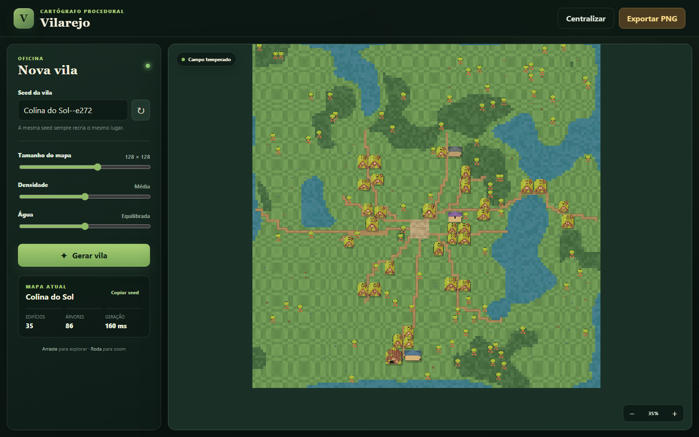

# Vilarejo — Gerador procedural de vila 2D

## Estado atual

O projeto entrega uma aplicação web local e offline capaz de criar vilas medievais orgânicas determinísticas. A interface oferece seed editável e aleatória, **seletor de bioma** (temperado, árido, nevado, úmido), mapa entre 80 e 160 tiles, densidade residencial, quantidade de água, **rio opcional**, câmera com arraste e zoom, centralização, **legenda de terreno** com barra de composição e exportação do mapa completo em PNG.

O núcleo gera elevação e umidade por value noise e classifica sete terrenos (água, areia, campo, mata, terra, neve e pântano) conforme o bioma escolhido, abre uma praça central de tamanho variável, conecta as bordas e ramais por A* ponderado, distribui lotes orientados para as vias e valida limites, sobreposição, água e conectividade de todas as portas. A configuração padrão produz entre 25 e 40 casas mais serviços centrais (prefeitura, hospedaria, loja, ferraria) e alguns serviços extras conforme o tamanho (capela, mercado, moinho, torre). Cada edifício recebe uma `variant` e um `material` estáveis por seed, para variedade visual.

O renderizador desenha o terreno com texturas reais amostradas de `ninja-floor.png` (variação por coordenada, sem emenda), estradas de terra, e edifícios que combinam sprites reais de `ninja-village.png` com desenho procedural por material (sapê, telha, madeira, pedra), incluindo capela com cruz, moinho com pás, torre com ameias e bandeira, ferraria com chaminé acesa, entre outros. **Como a geração passou a usar mais terrenos e variação, seeds antigas renderizam de forma diferente** — comportamento esperado num gerador procedural.

Sobre isso há um passe **2.5D** (luz padronizada no noroeste): relevo do terreno por *hillshade* a partir da elevação já calculada, sombras longas e direcionais projetadas para o sudeste (unificadas em uma camada para não escurecer por empilhamento), faces de telhado/parede com volume (lado iluminado vs. sombreado) e oclusão de contato na base. Um acabamento estático aplica tom ambiente por bioma e uma vinheta suave, tudo embutido também no PNG exportado. É puramente visual — não altera os dados do `VillageMap` nem o determinismo.

## Como executar

No Windows, dê duplo clique em `INICIAR.cmd`. O servidor será iniciado minimizado e o navegador abrirá em `http://127.0.0.1:4173`. Como alternativa, abra um terminal nesta pasta, execute `node server.mjs` e visite o mesmo endereço. Use `Ctrl+C` no terminal para encerrar o servidor.

Os testes podem ser executados com `npm.cmd test`. O sufixo `.cmd` é necessário neste computador porque a política do PowerShell bloqueia o script `npm.ps1`. A checagem rápida de sintaxe usa `npm.cmd run check`.

## Arquitetura

`src/core` contém o PRNG, ruído, pathfinding, geração e validação sem qualquer acesso ao navegador. `src/render/renderer.js` consome o mapa sem modificá-lo, cria uma camada estática do mundo e controla câmera e exportação. `src/app.js` conecta formulário, métricas, atalhos e downloads. `server.mjs` serve somente arquivos dentro do diretório do projeto e aceita apenas GET e HEAD.

O contrato principal é `generateVillage(seed, settings) -> VillageMap`. O resultado é serializável e inclui terreno, elevação, umidade, praça, estradas, edifícios, decorações, estatísticas e validação. Isso permite adicionar exportação JSON ou importar as vilas em uma engine futura sem reescrever o gerador.

## Arte e licença

As folhas `assets/tiles/ninja-village.png` e `assets/tiles/ninja-floor.png` vêm do pacote Ninja Adventure de Pixel-Boy, distribuído sob CC0 1.0. Os créditos e a fonte oficial estão registrados em `assets/CREDITS.md`. Elementos ausentes são desenhados por código e funcionam como fallback se a imagem não carregar.

## Verificação e próximos passos

A suíte cobre determinismo, seeds vazias, Unicode e longas, estrutura do terreno, quantidade de casas, detecção de mapas adulterados, 300 seeds válidas consecutivas e geração abaixo de 500 ms. A próxima evolução recomendada é exportar o `VillageMap` em JSON e adicionar um personagem caminhável com colisão. Depois disso, interiores, NPCs e biomas sazonais podem ser implementados sem alterar o contrato principal.
