<div align="center">

# 🏘️ Village Gen

### Gerador procedural de vilas medievais em 2.5D isométrico

Gere povoados, vilas e cidades inteiras a partir de uma seed — diretamente no navegador, sem engine, sem CDN e sem dependências de execução além do Node.js.


**Determinístico · Offline · Leve · Sem frameworks · Preparado para outros jogos**

</div>

---

## ✨ O que é o projeto?

O **Village Gen** cria assentamentos medievais completos em mapas isométricos. Cada seed define terreno, água, relevo, ruas, pontes, distritos, lotes, construções, plantações, árvores e objetos decorativos. A mesma seed, com as mesmas configurações, sempre produz a mesma vila.

A geração segue o fluxo `rua → segmento → fachada → lote → construção`. Isso faz os prédios acompanharem as vias, respeitarem áreas secas e ocuparem lotes funcionais, em vez de serem espalhados aleatoriamente pelo mapa.

> 💡 O modelo interno já foi organizado para futuros conversores de mapas para **Minecraft**, jogos de construção inspirados em **SimCity** e até mapas com setores no estilo **Doom**.

## 🌟 Destaques

| Recurso | O que está disponível |
|:--|:--|
| 🌱 Geração determinística | A mesma seed e as mesmas opções recriam exatamente a mesma estrutura |
| 🗺️ Escalas | Povoado, vila e cidade; mapas de 72, 96 e 128 tiles |
| 🌦️ Biomas | Campo temperado, sertão árido, planalto nevado e pântano |
| 🛣️ Traçados | Caminhos orgânicos ou quadras ortogonais |
| 🏘️ Urbanismo | Segmentos viários, fachadas, lotes e alinhamento das construções |
| 🧭 Distritos | Residencial, mercantil, oficinas, cívico e rural |
| 🌉 Pontes | Travessias retas e contínuas, ligadas a duas margens secas |
| 🏠 Arquitetura | 112 sprites temperados, com famílias, variantes e quatro orientações |
| 🎥 Câmera | Arraste, zoom e centralização do mapa |
| 🖼️ Exportação | PNG do mapa completo, independentemente da posição da câmera |
| 📴 Uso offline | Nenhum CDN, fonte remota ou chamada de rede durante o uso |
| 🧪 Qualidade | 44 testes automatizados, incluindo uma bateria de 300 seeds |

## 🚀 Início rápido

### Windows

Instale o [Node.js 20 ou superior](https://nodejs.org/), clone este repositório e dê dois cliques em **`INICIAR.cmd`**. O servidor será aberto em segundo plano e o navegador seguirá para `http://127.0.0.1:4173`.

Também é possível iniciar manualmente:

```powershell
git clone https://github.com/LightWolfMan/village-gen.git
cd village-gen
npm start
```

### macOS e Linux

Com o Node.js 20 ou superior instalado:

```bash
git clone https://github.com/LightWolfMan/village-gen.git
cd village-gen
npm start
```

Depois, abra [http://127.0.0.1:4173](http://127.0.0.1:4173) no navegador.

> 🌍 **Repositório público:** qualquer pessoa pode clonar o projeto sem precisar de acesso especial. Uma cópia já clonada continua funcionando offline.

## ✅ O que precisa ser instalado?

| Objetivo | Obrigatório | Observação |
|:--|:--|:--|
| Usar o gerador | Node.js 20+ e navegador moderno | Não é necessário executar `npm install` |
| Alterar o código | Editor de sua preferência | O projeto usa JavaScript modular sem frameworks |
| Rodar os testes | Node.js 20+ | O executor de testes já faz parte do Node.js |
| Regenerar a arte no Windows | Blender 4.5+ e PowerShell 7 | Os PNGs prontos já estão versionados |
| Regenerar a arte no macOS/Linux | Blender 4.5+ | Os scripts Python podem ser chamados pelo Blender diretamente |

Em outras palavras: para **recriar e executar a aplicação em qualquer computador**, basta clonar o repositório e instalar Node.js 20+. O Blender é uma ferramenta de produção; ele não faz parte do funcionamento normal do aplicativo.

## 🎮 Como usar

| Ação | Controle |
|:--|:--|
| Criar outro mapa | Clique em **Gerar novo vilarejo** |
| Repetir um mapa | Digite ou cole a seed e pressione **Enter** |
| Mover a câmera | Clique e arraste o mapa |
| Aproximar ou afastar | Use a roda do mouse |
| Voltar ao enquadramento inicial | Clique em **Centralizar** |
| Ver os distritos | Ative a visualização de zonas |
| Salvar o mapa | Use **Exportar PNG** |

As opções de bioma, tamanho, água, rios, traçado e escala do assentamento fazem parte da geração. Para reproduzir um resultado, preserve tanto a seed quanto essas configurações.

## 🧠 Como a geração funciona

```mermaid
flowchart LR
    A["🌱 Seed + configurações"] --> B["⛰️ Terreno e água"]
    B --> C["🛣️ Estradas e praça"]
    C --> D["🌉 Pontes e segmentos"]
    D --> E["🧭 Distritos"]
    E --> F["📐 Fachadas e lotes"]
    F --> G["🏠 Construções e serviços"]
    G --> H["🌳 Props e vegetação"]
    H --> I["✅ Validação"]
    I --> J["🖼️ Renderização e PNG"]
```



O núcleo é independente da tela e expõe a ideia de `generateVillage(seed, settings) → VillageMap`. O resultado usa exclusivamente `schemaVersion: 3` e é serializável, o que facilita criar exportadores sem acoplar a lógica ao Canvas.

### VillageMap v3 em poucas palavras

| Estrutura | Responsabilidade |
|:--|:--|
| `terrain`, `heightLevel` | Tipo e altura de cada tile |
| `zoneMap`, `zones` | Zoneamento funcional do assentamento |
| `roads`, `roadSegments` | Malha viária, conexões cardinais e trechos retos |
| `bridgeSpans` | Pontes ordenadas entre margens secas |
| `frontages` | Faixas edificáveis voltadas para as ruas |
| `lots` | Células, limites, acesso e ocupação dos lotes |
| `buildings` | Família, variante, orientação, porta, lote e fachada |
| `props` | Árvores, plantas, pedras, cercas e objetos de cenário |
| `validation` | Resultado das verificações estruturais do mapa |

## 🏗️ Arquitetura do projeto

```text
village-gen/
├── assets/                  # Sprites e documentação visual
│   ├── buildings/           # 112 edifícios temperados
│   └── environment/         # Vias, pontes, vegetação e objetos
├── src/
│   ├── core/                # Geração determinística e validação
│   ├── render/              # Canvas isométrico e câmera
│   └── app.js               # Interface, eventos e exportação
├── tests/                   # Testes nativos do Node.js
├── tools/blender/           # Modelagem e renderização reproduzíveis
├── index.html               # Interface principal
├── styles.css               # Aparência da aplicação
├── server.mjs               # Servidor local sem dependências
├── INICIAR.cmd              # Inicialização rápida no Windows
├── PROJETO.md               # Arquitetura e histórico técnico
└── package.json             # Comandos do projeto
```

O Canvas renderiza terreno, água, profundidade, sombras e fallbacks procedurais. Os edifícios e objetos temperados são pré-renderizados no Blender, mantendo a aparência 2.5D detalhada sem exigir 3D em tempo real.

## 🧪 Desenvolvimento e testes

Não há pacotes de runtime para instalar. Os comandos principais são:

| Comando | Finalidade |
|:--|:--|
| `npm start` | Inicia o servidor local na porta 4173 |
| `npm test` | Executa toda a suíte automatizada |
| `npm run check` | Verifica a sintaxe dos módulos principais |
| `npm run art:buildings` | Regenera edifícios temperados no Windows |
| `npm run art:environment` | Regenera vias, pontes e props no Windows |
| `npm run art:all` | Regenera todo o conjunto Blender no Windows |

Os testes verificam determinismo, limites do mapa, colisões, água, portas, acesso à praça, lotes, fachadas, zoneamento, topologia das vias, pontes, manifestos, transparência dos PNGs, exportação e servidor local.

<details>
<summary><strong>🎨 Como regenerar os sprites Blender</strong></summary>

No Windows, confirme que `blender` está disponível no `PATH` ou ajuste o caminho usado pelos scripts em `tools/blender`. Em seguida execute:

```powershell
npm run art:all
```

Os scripts geram modelos e PNGs de forma reproduzível. No macOS e Linux, os arquivos Python dentro de `tools/blender` podem ser executados diretamente pelo Blender em modo background; os atalhos `npm run art:*` usam PowerShell e foram preparados principalmente para Windows.

Consulte [`assets/ART.md`](assets/ART.md), [`assets/buildings/ART.md`](assets/buildings/ART.md) e [`assets/environment/ART.md`](assets/environment/ART.md) antes de alterar o pipeline visual.

</details>

<details>
<summary><strong>🛠️ Solução de problemas</strong></summary>

**O comando `node` não foi encontrado.** Instale o Node.js 20 ou superior, feche e abra o terminal novamente e confirme com `node --version`.

**A página não abriu sozinha.** Execute `npm start` e abra manualmente `http://127.0.0.1:4173`.

**A porta 4173 já está em uso.** Feche outra instância do gerador que esteja aberta e inicie novamente.

**O clone do GitHub falhou.** Confira sua conexão, confirme a URL do repositório e tente novamente.

**Um sprite não apareceu.** O renderer possui fallback procedural, então o mapa continua utilizável. Rode os testes e confira os manifestos de arte para descobrir qual PNG está ausente.

</details>

## 🧭 Roadmap

- [x] Geração determinística por seed
- [x] Quatro biomas e duas topologias viárias
- [x] Urbanismo por segmentos, fachadas e lotes
- [x] Zoneamento funcional
- [x] Pontes contínuas e sprites Blender
- [x] Exportação PNG do mapa completo
- [ ] Exportação do `VillageMap` em JSON
- [ ] Conversor experimental para Minecraft
- [ ] Famílias Blender completas para todos os biomas
- [ ] Personagem, colisão e malha navegável
- [ ] Editor manual de ruas e lotes
- [ ] Clima, iluminação dinâmica e população simulada

## 📚 Documentação

| Documento | Conteúdo |
|:--|:--|
| [`PROJETO.md`](PROJETO.md) | Arquitetura, contrato v3, decisões, validação e histórico |
| [`assets/ART.md`](assets/ART.md) | Visão geral do pipeline visual |
| [`assets/buildings/ART.md`](assets/buildings/ART.md) | Famílias arquitetônicas, variantes e âncoras |
| [`assets/environment/ART.md`](assets/environment/ART.md) | Estradas, pontes, plantas e objetos |

## 🔒 Licença e uso

O repositório está **público**, mas ainda não possui uma licença de reutilização definida. O código e os assets atuais são originais deste projeto; nenhum asset proprietário de SimCity, Pokémon, Ninja Adventure ou de outros jogos foi incorporado.

Antes de permitir reutilização ou distribuição externa, será necessário definir os termos em um arquivo `LICENSE`.

---

<div align="center">

Feito para transformar uma seed em um lugar com ruas, bairros e personalidade. 🌱🏘️

</div>
